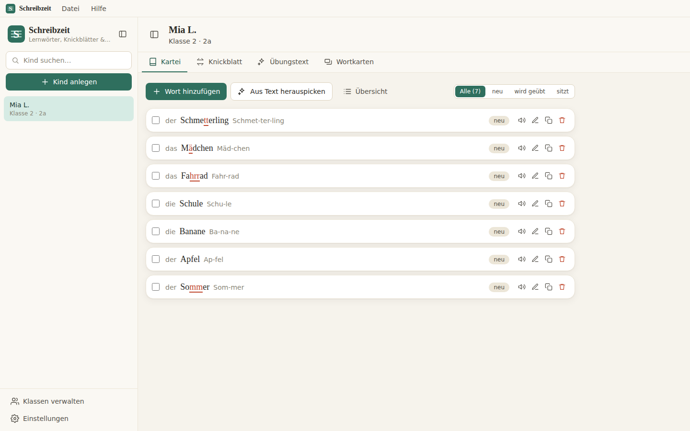
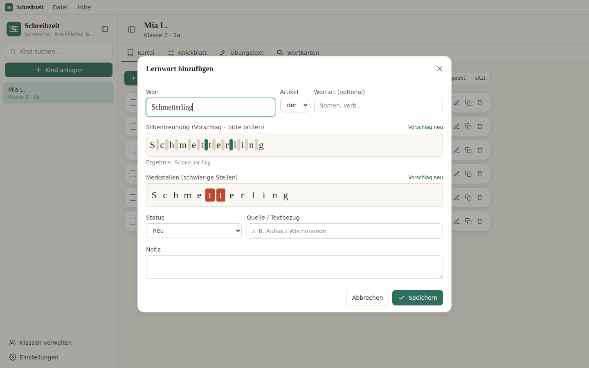
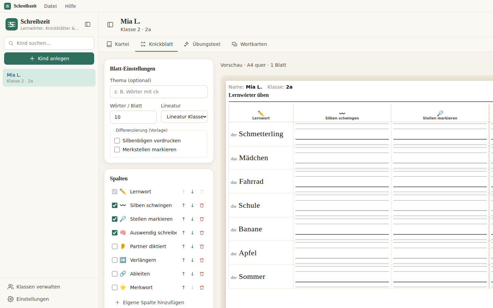
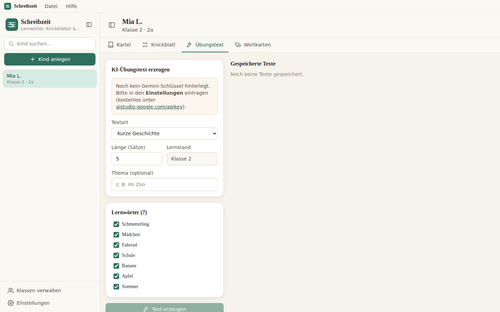
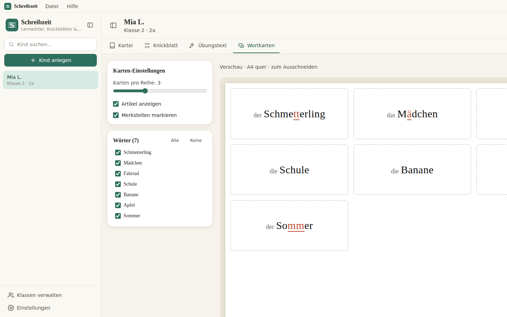

<h1 align="center">✏️ Schreibzeit</h1>

<p align="center">
  Lernwörter-Kartei, Knickblätter &amp; KI-Übungstexte für Grundschullehrkräfte
</p>

<p align="center">
  
  
  
  
  
  
  
</p>

<p align="center">
  Pro Kind eine Lernwörter-Kartei führen und daraus per Klick druckfertige Knickblätter,
  Wortkarten und passende Übungstexte erzeugen – komplett offline und ohne Adminrechte.
</p>

<!-- HERO-BILD — siehe docs/screenshots/README.md für Aufnahme- & Anonymisierungs-Leitfaden -->
<p align="center">
  
  <br />
  <sub><i>Kind-Kartei links, Knickblatt-Generator mit Live-Vorschau rechts.</i></sub>
</p>

---

## ✨ Überblick

**Schreibzeit** ist ein Werkzeug für Grundschullehrkräfte, um die individuellen **Lernwörter** jedes Kindes zu sammeln und daraus automatisch **Übungsmaterial** zu erstellen.
Gebaut mit **React, TypeScript und Electron** – als reine Web-App (PWA) und als Desktop-App aus **einer gemeinsamen Codebasis**.

Entwickelt für den realen Schulalltag: schnell, ruhig, professionell – und **datenschutzfreundlich**, weil alle Daten lokal auf dem Gerät bleiben.

✔ Vollständig offline nutzbar (Kartei, Knickblatt, Wortkarten, Druck)
✔ Web/PWA **und** macOS &amp; Windows
✔ **Ohne Adminrechte** (Web/PWA + Windows-Portable-.exe)
✔ Local-first &amp; DSGVO-freundlich – kein Tracking, keine Telemetrie

---

## 📸 Screenshots

<table>
  <tr>
    <td width="50%" align="center">
      <br />
      <b>Lernwörter-Kartei</b>
    </td>
    <td width="50%" align="center">
      <br />
      <b>Wort-Editor (Silben &amp; Merkstellen)</b>
    </td>
  </tr>
  <tr>
    <td width="50%" align="center">
      <br />
      <b>Knickblatt-Generator</b>
    </td>
    <td width="50%" align="center">
      <br />
      <b>KI-Übungstexte &amp; Lückentext</b>
    </td>
  </tr>
  <tr>
    <td colspan="2" align="center">
      <br />
      <b>Wortkarten zum Ausschneiden</b>
    </td>
  </tr>
</table>

---

## ✨ Hauptfunktionen

### 🗂️ Lernwörter-Kartei pro Kind
- Klassen &amp; Kinder verwalten, Lernstand (Klasse 1–4, Förderbedarf, LRS)
- Pro Wort: Artikel, Wortart, **Silbentrennung**, **Merkstellen**, Status, Quelle, Notiz
- Status `neu` · `wird geübt` · `sitzt` mit Filter &amp; Sortierung
- Hinzufügen, bearbeiten, löschen, duplizieren, Massenaktionen
- Durchsuchbare Sidebar, schnelles Umschalten zwischen Kindern

---

### 🔎 Wörter aus Text herauspicken
- Kindertext einfügen **oder Foto hochladen** → Wörter anklicken → in die Kartei übernehmen
- **Foto-Texterkennung (OCR):** Standard über Gemini, optional über **Claude Vision** (besonders gut bei Handschrift, in den Einstellungen aktivierbar)
- **Dublettenprüfung** gegen die vorhandene Kartei (bereits vorhandene Wörter markiert)
- Automatischer Silben-, Artikel- &amp; Merkstellen-Vorschlag beim Übernehmen

---

### ✏️ Automatische Hilfen (immer editierbar)
- **Wörterbuch-Silbentrennung** (offline, deutsche Trennmuster) – z. B. *Ap-fel*, *Som-mer*, *Erd-bee-re*
- **Artikel-Vorschlag** (der/die/das) aus einem Grundwortschatz-Datensatz beim Tippen
- **Merkstellen-Vorschlag**: Doppelkonsonanten, *ie/ck/tz/ß*, Dehnungs-h, *v*, Umlaute, Diphthonge
- Trennstellen &amp; Merkstellen per Klick korrigieren

---

### 📄 Knickblatt-Generator (Herzstück)
- DIN **A4 quer**, Zeilen = Lernwörter (Anzahl einstellbar, Standard 10)
- Spalten = Übungsstrategien, an-/abschaltbar &amp; sortierbar:
  - **Lernwort (Vorlage)** · **Silben schwingen** · **Stellen markieren** · **Auswendig schreiben** (mit gestrichelter **Falzlinie**) · **Partner diktiert**
- FRESCH-Presets: **Verlängern**, **Ableiten**, **Merkwort**
- **Eigene Spalten** hinzufügen, vorhandene **umbenennen, löschen** und sortieren
- Echte **Grundschul-Lineatur** (Klasse 1–4 / Haus-Lineatur mit Mittelband), mm-genau
- **Differenzierung**: Vorlage mit vorgedruckten Silbenbögen und/oder Merkstellen
- Wortauswahl per Filter (Status, neueste, Zufall) · **Live-Vorschau** · Druck/PDF

---

### 🃏 Wortkarten
- Raster mehrerer Kärtchen pro A4-Seite zum Ausschneiden für den Karteikasten
- Mit Artikel und markierten Merkstellen, Spaltenzahl einstellbar

---

### 🤖 KI-Übungstexte (Google Gemini)
- Kurze Geschichte, **Lückentext** oder Quatschsätze mit den Lernwörtern des Kindes
- Lernstandsgerecht (Klasse 1–4 / Förderbedarf / LRS), Thema optional
- Lückentext mit automatischer **Lösungswörter-Liste**
- Texte bearbeiten, am Kind speichern und drucken
- Verständliche deutsche Fehlermeldungen (kein Schlüssel, Limit, Netzwerk, Safety-Filter)

---

### 💾 Backup &amp; Datenportabilität
- Export aller Daten als **JSON** (Backup, Umzug zwischen Schul-PCs)
- Import mit **Zusammenführen** oder **Ersetzen** (mit Sicherheitsabfrage)
- Optional Export einzelner Kinder

---

## 🔐 Datenschutz (DSGVO)
- **Local-first:** alle Daten ausschließlich lokal (IndexedDB) auf dem Gerät
- **Keine Telemetrie, kein Tracking, keine externen Aufrufe** – einzige Ausnahme: der bewusst ausgelöste Gemini-Aufruf
- Option **„nur Initialen/Spitznamen statt Klarnamen"**
- **„Alle Daten löschen"** entfernt sämtliche Daten unwiderruflich

---

## 🛠️ Tech-Stack

| Ebene | Technologie |
| ----- | ----------- |
| Desktop-Shell | **Electron** + electron-builder (dmg · nsis · **portable**) |
| UI | **React 19** + **TypeScript** |
| Styling | **Tailwind CSS v4** (token-basiertes, papierhaftes Theme) |
| State | **Zustand** + reaktive **Dexie** Live-Queries |
| Persistenz | **IndexedDB** via Dexie.js (austauschbare Repository-Abstraktion) |
| PWA | Service Worker + Manifest (offline, installierbar) |
| Druck/PDF | dediziertes Print-CSS (A4 quer, mm-Lineatur, Falzlinie) → Browser-Druck |
| KI | **Google Gemini** (Text &amp; OCR) und optional **Claude Vision** (OCR) über `fetch` |
| Wörterbuch | Offline-Silbentrennung über deutsche Trennmuster (`hyphen`) + kuratierte Artikel-Liste |
| Build | **Vite** · Tests mit **Vitest** |

Die App ist **offline-first**: jedes Projekt liegt lokal, der gesamte State bleibt auf dem Gerät, und die KI-Integration ist **opt-in**.

---

## 🚀 Erste Schritte

**Voraussetzung:** [Node.js](https://nodejs.org/) **22+** und npm (Vite 8 benötigt Node ≥ 22.12).

```bash
# 1. Abhängigkeiten installieren
npm install

# 2. Entwicklungsserver (Web, Hot-Reload → localhost:5173)
npm run dev

# 3. Typecheck, Lint & Tests
npm run lint
npm test

# 4. Produktionsbuild (Web/PWA → dist/)
npm run build

# 5. Desktop bauen
npm run electron:dev    # App im Electron-Fenster (Dev)
npm run build:win       # Windows: NSIS-Installer + Portable-.exe
npm run build:mac       # macOS: .dmg
```

> **Ohne Adminrechte an Schul-PCs:** entweder die gehostete **Web/PWA**-Version
> (über „Installieren" zum Startbildschirm) oder die **Windows-Portable-.exe**
> aus den [Releases](../../releases) – einfach doppelklicken, keine Installation.

> **CORS-Hinweis:** Aus einer als reine Datei (`file://`) geöffneten Seite kann
> der Browser den Gemini-Aufruf wegen „null origin" blockieren. Kartei,
> Knickblatt, Wortkarten und Druck laufen dann trotzdem vollständig offline.
> Die KI-Funktion arbeitet zuverlässig in der Web/PWA- und der Desktop-Version.

---

## 🤖 Gemini-Schlüssel einrichten

1. Kostenlosen API-Schlüssel holen: <https://aistudio.google.com/apikey> (ohne Kreditkarte)
2. In Schreibzeit: **Einstellungen → KI-Textfunktion → API-Schlüssel** einfügen
3. Standardmodell **`gemini-2.5-flash`** (Free-Tier); Modellname frei änderbar

Der Schlüssel wird nur lokal gespeichert. Übertragen werden ausschließlich die ausgewählten **Lernwörter** und die Aufgabenbeschreibung – **keine Kindernamen**.

**Optional – bessere Foto-Texterkennung mit Claude Vision:** In den Einstellungen aktivierbar; benötigt einen Claude-Schlüssel von [console.anthropic.com](https://console.anthropic.com/settings/keys) (Standardmodell `claude-opus-4-8`, frei änderbar). Ohne Claude-Schlüssel wird die Foto-Texterkennung über Gemini ausgeführt. Foto-Uploads gehen nur beim Erkennen an die KI.

---

## 📚 Dokumentation

- [`README` Build &amp; Architektur](#-tech-stack) — Tech-Stack &amp; Build-Skripte oben
- [`docs/screenshots/README.md`](docs/screenshots/README.md) — Leitfaden zum Aufnehmen &amp; Anonymisieren der Screenshots
- Quellstruktur: `src/core` (Logik) · `src/db` (Persistenz) · `src/services` (Backup, Gemini) · `src/views` (Oberfläche) · `electron/` (Desktop)

---

## 🧩 Erweiterbar gebaut

Modular &amp; datengetrieben, damit Erweiterungen ohne Umbau der Kernlogik möglich sind:

- Weitere **Blatt-/Diktatformen** (Spaltendiktat, Dosendiktat, Laufdiktat) als zusätzliche Generatoren
- Neue **Knickblatt-Spalten** rein datengetrieben über `SPALTEN_DEFS`
- **Cloud-Sync** später über die `Repository`-Abstraktion andockbar
- **i18n** vorbereitet (Auslieferung aktuell Deutsch)

---

## 👤 Autor

Entwickelt und gepflegt von **Lars Zumpe**

---

## ❤️ Unterstützen / Spenden

Wenn dir Schreibzeit Vorbereitungszeit spart, freue ich mich über einen Kaffee:

<p>
  <a href="https://paypal.me/larszumpe">
    
  </a>
</p>

Spenden sind völlig optional — die App bleibt so oder so MIT-lizenziert und kostenlos. 🙌

---

## 📄 Lizenz

[MIT](./LICENSE)
